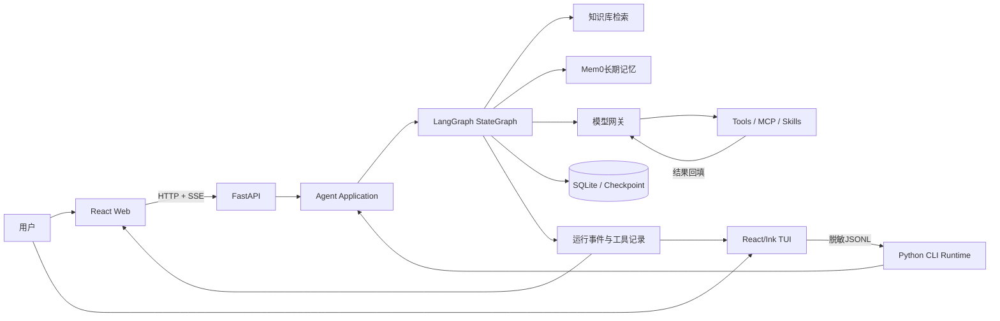
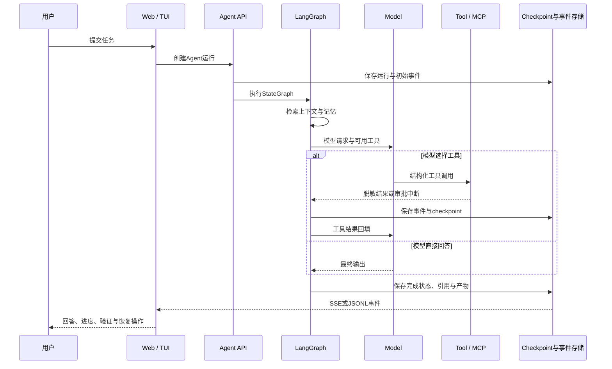
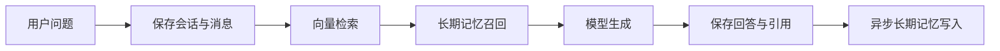
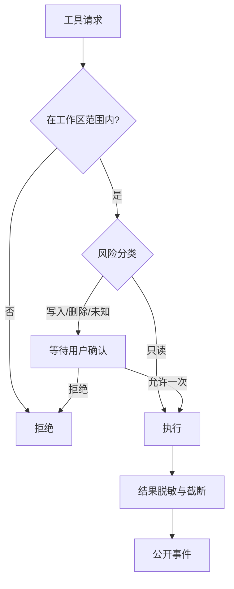

# 系统架构

AgentLens采用双客户端、单运行内核：React Web和Linux TUI使用不同传输层，但最终进入同一套Agent工具、权限和LangGraph状态机。

## 总览



## 模块职责

| 模块 | 主要职责 | 关键入口 |
| --- | --- | --- |
| React Web | 对话、知识库、设置、运行轨迹、审批与变更审阅 | `frontend/react/src/App.jsx` |
| FastAPI | 认证、API路由、SSE、静态资源和运行时生命周期 | `backend/knowflow/app.py` |
| Chat路由 | 普通RAG对话与Agent请求分流 | `backend/knowflow/routers/chat.py` |
| Agent API | 组装工具、Skills、MCP，创建和恢复运行 | `backend/knowflow/routers/extensions.py` |
| LangGraph引擎 | 检索、记忆、模型和工具节点的状态机 | `backend/knowflow/services/langgraph_agent_engine.py` |
| 模型网关 | Chat Completions与Responses协议适配 | `backend/knowflow/services/model_gateway.py` |
| MCP客户端 | 发现并调用远程MCP工具，管理运行级会话 | `backend/knowflow/services/mcp_client.py` |
| 记忆层 | Mem0召回、异步写入与运行状态 | `backend/knowflow/services/memory.py` |
| 数据层 | SQLAlchemy、向量检索、checkpoint与运行产物 | `backend/knowflow/database.py` |
| CLI/TUI | Linux BYOK入口、工作区交互、审批与恢复 | `backend/knowflow/cli.py`、`cli-tui/src/app.jsx` |

## Agent核心链路



状态机节点为：

```text
START → retrieval_context → memory_recall → model ↔ tools → END
```

工具调用不是模型直接操作系统。模型只产生结构化调用请求，运行时负责校验参数、权限、工作区和沙箱边界，然后把公开结果重新送回模型。

## 普通知识库对话

不需要Agent工具时，请求走更短的RAG链路：



知识库引用与长期记忆是两种数据：引用用于解释本次答案依据，长期记忆用于跨会话保留稳定偏好和事实。

## 事件与恢复

Web通过SSE接收实时事件，断线后按运行ID重连；TUI通过Python与Ink之间的脱敏JSONL协议投影相同状态。运行事件、工具调用和checkpoint分别承担：

- **运行事件**：驱动任务条、步骤、状态和错误恢复界面。
- **工具记录**：保留公开输入、输出摘要、耗时与错误码。
- **checkpoint**：保存LangGraph状态，使`/continue`和按范围重试不必重跑整个任务。

完整事件字段见[Agent事件协议](agent-event-protocol.md)。

## 权限与数据边界



主要持久化内容包括主数据库、知识库向量、LangGraph checkpoint、Skills、工作区快照、工具结果和Mem0数据。生产备份必须覆盖整组状态，不能只备份主数据库。

## 部署约束

- 当前运行协调器采用单worker，避免SQLite checkpoint、本地Qdrant和异步任务出现多进程竞争。
- 生产服务使用非root用户，运行数据目录由服务用户读写，静态资源只读。
- 公网部署使用HTTPS、Secure Cookie和精确OAuth返回origin白名单。
- 不提交`.env`、数据库、上传文件、用户Skills、工作区、工具结果、Mem0或checkpoint。
