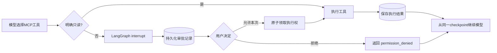

# LangGraph MCP写操作审批

LangGraph执行器现在可以暴露用户已启用的全部MCP工具。明确只读的工具直接执行；写入、删除、破坏性或风险未知的工具先暂停，只有当前登录用户允许本次调用后才执行。

审批记录同时绑定`user_id`、`run_id`和模型生成的`tool_call_id`。跨用户访问按不存在处理，同一审批只能解决一次，同一写调用只能成功领取一次执行权。

LangGraph在恢复`interrupt()`时会从节点开头重新运行。因此工具节点每次只处理一个调用，多个写调用会逐个暂停，前一个已完成调用不会因后一个审批而重放。远程副作用完成后若进程在结果持久化前中断，记录会停在`executing`；系统不会自动重试，而是返回`tool_execution_indeterminate`，避免重复写入。

当前前端收到`approval_required`后保留运行中的消息。审批API解决记录并启动原运行恢复，前端随后重新订阅运行事件；即使恢复在线程订阅前已经完成，也会从持久化运行快照和assistant消息取得最终结果。

生产部署仍需把业务数据库与`KNOWFLOW_LANGGRAPH_CHECKPOINT_DB`放在同一停止服务时刻的备份中。当前SQLite checkpointer适合Windows本地版和单实例服务器；多实例部署应迁移到LangGraph官方共享checkpointer。
