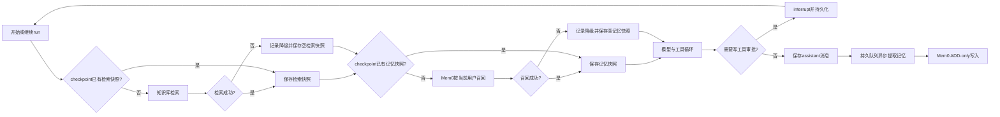

# LangGraph长期记忆生命周期

LangGraph主图会先完成知识库检索（启用RAG时），再召回当前用户的Mem0长期记忆，并把两类上下文写入同一run的checkpoint。审批恢复、进程内重试和`/plan`后续步骤直接复用快照，不重复调用检索或Mem0。检索、召回失败都会留下脱敏失败Trace并降级为空上下文，模型仍继续回答。

## 为什么写入不放进主图

长期记忆写入依赖assistant消息ID，并且可能遇到模型限流、网络故障或向量服务暂不可用。现有`MemoryOperationStore`与`MemoryOperationRunner`已经提供持久状态、重试和前端活动投影，因此继续作为图外后台副作用更可靠。主图只负责回答前必须稳定复用的召回状态，回答无需等待记忆提取完成。

## 安全与恢复

- 召回和写入始终由认证用户ID限定Mem0命名空间，模型不能传入其他用户ID。
- 记忆只作为不可信背景文本注入system消息；当前用户消息优先，记忆中的指令不会被执行。
- checkpoint会保存注入后的消息、检索快照和召回快照，必须按业务敏感数据保护，并与主数据库在同一停服时刻备份。
- 当前图状态schema为v2；恢复器继续读取v1审批checkpoint，新写入统一使用v2，未知版本拒绝自动恢复。
- Trace恢复会续接原有run、计划步骤和审批节点，不再用新的空Trace覆盖历史。
- 后台写入仍使用幂等operation记录；远程副作用状态不明确时不盲目重放。
