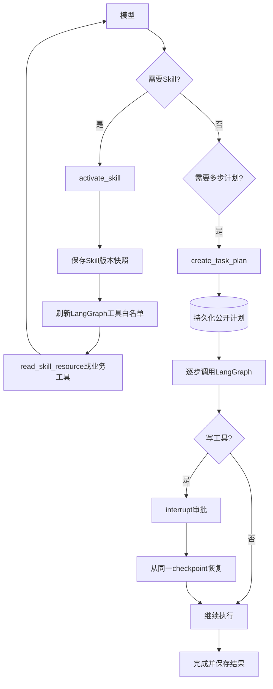

# LangGraph Skills与任务计划

LangGraph执行器复用现有Skill和任务计划协议，不复制用户数据、不执行Skill脚本，也不改变前端API。Skill仍由`SkillActivationSession`负责用户隔离、依赖校验和`references/`只读边界；任务计划仍持久化到现有`agent_run`与`agent_run_step`表。

## checkpoint恢复

独立的`skill_snapshot`状态只保存Skill安装ID、slug、版本和内容哈希。恢复时重新从当前用户的安装记录解析Skill，并严格比对完整快照；Skill被禁用、依赖缺失或内容变化都会终止恢复，不会悄悄换用其他版本。恢复成功后才重新注册`read_skill_resource`，并移除一次性的`activate_skill`。

模型消息checkpoint会保留本轮执行所需的Skill指令和对话内容，因此checkpoint数据库属于敏感业务数据，必须与主数据库采用相同的访问控制、备份和销毁策略，不得公开或提交到Git。前端Trace和工具审计仍只输出脱敏摘要，不暴露Skill正文。

工具白名单在每个模型节点和工具节点前动态计算，因此Skill激活后新增的资源工具立即可见，恢复后也不会沿用旧进程里的可变注册表。`create_task_plan`成功后立即结束本轮图执行，并丢弃同一模型响应中排在它后面的工具调用；外层持久化协调器再按公开计划逐步调度，避免`/plan`误执行或重复建计划。

## 当前边界

- `scripts/`只保存供检查，不执行。
- Skill不能创建新工具、绕过MCP配置或跳过写操作审批。
- 计划步骤由现有持久化运行协调器依次调度，每个步骤内部使用LangGraph模型/工具循环。
- Mem0召回已是主图首个节点；同一run的计划步骤复用checkpoint中的召回快照。
- 回答后的Mem0提取仍由现有持久队列异步执行，不阻塞图和用户响应。
