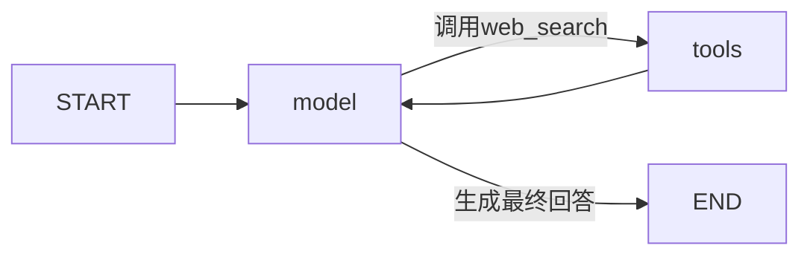

# LangGraph联网搜索工具循环

## 范围

本阶段把`web_search`和明确标记为只读的MCP工具迁入LangGraph，形成可checkpoint恢复的`模型 → 工具 → 模型`循环。默认`current`执行器不变，MCP写操作、Skills、审批、任务计划和Mem0仍不向LangGraph开放。

图使用LangGraph官方条件边和SQLite checkpointer。模型网关继续返回现有OpenAI兼容字典，工具调用继续复用`ToolRegistry`的参数校验、错误归一化和审计回调，不新增第二套工具注册机制。

## 安全边界

LangGraph使用工具注册表的执行引擎声明作为允许列表：

1. 模型请求只收到允许列表内的schema；
2. 工具节点执行前再次校验允许列表和工具声明的执行引擎；
3. 模型即使生成未暴露的写工具名称，也只会得到`unknown_tool`失败结果，handler不会执行；
4. `web_search`仍来自当前登录用户自己的工具配置，未配置或未启用时不会出现在schema中。

schema暴露和执行前校验都使用同一份执行引擎声明，可以阻止同名MCP工具冒充原生搜索，也能避免审批节点尚未迁移时发生越权执行。工具默认只允许`current`；原生Tavily搜索和明确带`readOnlyHint=true`且非破坏性的MCP工具才显式允许`langgraph`。

## checkpoint状态

checkpoint只保存JSON兼容数据：`schema_version`、`messages`、`answer`、`executions`和`tool_rounds`。模型配置、API Key、网关、工具handler、trace和回调只通过运行时上下文传入。

恢复规则：

- 模型节点失败时，从最近节点边界重新调用模型；
- `web_search`已完成而后续模型失败时，恢复后不重复搜索；
- 整图完成后，直接返回已保存回答；
- checkpoint缺失、损坏或属于其他用户时明确失败；
- 超过最大工具轮数时，在执行下一次工具之前失败。

本阶段只有只读工具。MCP写工具必须等审批interrupt和幂等边界一起落地后才能开放。

## 兼容与验证

- Chat Completions和Responses继续复用同一模型网关；
- 模型文本delta、工具执行回调和Agent trace沿用现有前端协议；
- 无工具时仍可完成单模型回答；
- 搜索工具结果会回传模型并生成最终回答；
- 未允许的写工具不会执行；
- 搜索后模型失败再恢复时，搜索handler只执行一次；
- API Key不会进入checkpoint；
- 用户隔离、缺失checkpoint和会话删除行为保持不变。

## 官方依据

- LangGraph Graph API：https://docs.langchain.com/oss/python/langgraph/graph-api
- LangGraph Tools：https://docs.langchain.com/oss/python/langchain/tools
- LangGraph Persistence：https://docs.langchain.com/oss/python/langgraph/persistence
